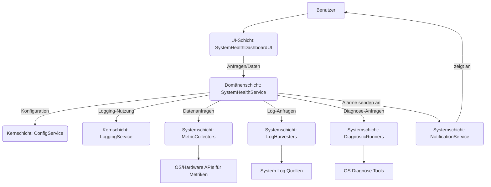

SPEZIFIKATION: SPEC-FEATURE-SYSTEM-HEALTH-DASHBOARD-v0.1.0
VERSION: 0.1.0
STATUS: ENTWURF
ABHÄNGIGKEITEN: [
    "SPEC-LAYER-CORE-v1.0.0",
    "SPEC-LAYER-DOMAIN-v1.0.0",
    "SPEC-LAYER-SYSTEM-v1.0.0",
    "SPEC-LAYER-UI-v1.0.0",
    "SPEC-MODULE-CORE-LOGGING-v1.0.0",
    "SPEC-MODULE-CORE-CONFIG-v1.0.0"
]
AUTOR: Jules AI Agent
DATUM: $(date +%Y-%m-%d)
ÄNDERUNGSPROTOKOLL:
- 0.1.0 ($(date +%Y-%m-%d)): Erster Entwurf der Spezifikation.

## 1. Zweck und Geltungsbereich

### 1.1 Zweck
Diese Spezifikation definiert die Anforderungen und das Design für das NovaDE System Health Dashboard. Das Dashboard dient als zentrale Anlaufstelle für Benutzer und Administratoren, um den Zustand des Systems in Echtzeit zu überwachen, auf Protokolldaten zuzugreifen, diagnostische Tests durchzuführen und Benachrichtigungen über potenzielle Probleme zu erhalten. Ziel ist es, die Transparenz des Systemzustands zu erhöhen und die Fehlerdiagnose zu vereinfachen.

### 1.2 Geltungsbereich
Diese Spezifikation umfasst:
- Die Sammlung und Anzeige von Systemmetriken (CPU, Speicher, Festplatte, Netzwerk, Temperatur).
- Die Darstellung von System- und Anwendungsprotokollen.
- Die Implementierung und Ausführung von grundlegenden diagnostischen Tests.
- Ein Alarmsystem für kritische Systemzustände.
- Die Interaktion des Dashboards mit anderen NovaDE-Schichten und -Modulen.

Nicht im Geltungsbereich dieser Version sind:
- Erweiterte automatische Problemlösung oder Selbstheilungsfunktionen.
- Detaillierte Leistungsanalyse-Tools (Profiling).
- Remote-Monitoring anderer Systeme.

## 2. Definitionen
- **Metrik**: Ein quantitativer Messwert, der einen Aspekt des Systemzustands repräsentiert (z.B. CPU-Auslastung in Prozent).
- **Protokolleintrag (Log Entry)**: Eine einzelne Nachricht, die von einer System- oder Anwendungskomponente protokolliert wurde.
- **Diagnostischer Test**: Ein vordefinierter Satz von Operationen zur Überprüfung der Funktionalität einer bestimmten Systemkomponente oder eines Aspekts.
- **Alarm (Alert)**: Eine Benachrichtigung, die ausgelöst wird, wenn eine Metrik einen vordefinierten Schwellenwert überschreitet oder ein kritisches Ereignis in den Protokollen erkannt wird.
- **Dashboard**: Die grafische Benutzeroberfläche zur Darstellung der gesammelten Informationen.

## 3. Anforderungen

### 3.1 Funktionale Anforderungen

#### 3.1.1 Metrikanzeige
- **FR-MET-001**: Das Dashboard MUSS Echtzeitwerte für folgende Systemmetriken anzeigen:
    - CPU-Gesamtauslastung (Prozent)
    - CPU-Auslastung pro Kern (Prozent)
    - Speicher-Gesamtauslastung (GB und Prozent)
    - Genutzter Swap-Speicher (GB und Prozent)
    - Festplattenauslastung pro Partition (GB und Prozent, Lese-/Schreibraten in MB/s)
    - Netzwerkaktivität pro Schnittstelle (Daten gesendet/empfangen in MB/s, Gesamtvolumen)
    - Systemtemperatur (Hauptkomponenten wie CPU, GPU, wenn verfügbar)
- **FR-MET-002**: Metriken SOLLTEN grafisch dargestellt werden (z.B. Liniendiagramme für Verlaufsdaten, Balkendiagramme für aktuelle Werte).
- **FR-MET-003**: Der Aktualisierungsintervall für Metriken MUSS konfigurierbar sein (Standard: 1 Sekunde).
- **FR-MET-004**: Das Dashboard KANN historische Daten für Metriken über einen begrenzten Zeitraum anzeigen (z.B. die letzten 60 Sekunden/Minuten).

#### 3.1.2 Protokollanzeige (Log Viewer)
- **FR-LOG-001**: Das Dashboard MUSS eine Ansicht für Systemprotokolle (z.B. journald) bereitstellen.
- **FR-LOG-002**: Das Dashboard MUSS eine Ansicht für Protokolle von NovaDE-eigenen Komponenten bereitstellen.
- **FR-LOG-003**: Protokolleinträge SOLLTEN mindestens Zeitstempel, Quelle, Priorität/Level und Nachricht anzeigen.
- **FR-LOG-004**: Der Log Viewer MUSS Filterfunktionen bereitstellen (z.B. nach Zeitbereich, Quelle, Priorität, Schlüsselwörtern).
- **FR-LOG-005**: Der Log Viewer SOLLTE neue Protokolleinträge in Echtzeit anzeigen (automatisches Scrollen optional).
- **FR-LOG-006**: Das Dashboard KANN das Exportieren von ausgewählten Protokolleinträgen ermöglichen.

#### 3.1.3 Diagnostische Tests
- **FR-DIA-001**: Das Dashboard MUSS eine Auswahl an grundlegenden diagnostischen Tests anbieten, die vom Benutzer gestartet werden können. Beispiele:
    - Netzwerk-Konnektivitätstest (Ping zu einem konfigurierten Host)
    - Festplatten-Integritätsprüfung (SMART-Status-Abfrage, wenn verfügbar)
    - Arbeitsspeicher-Kurztest (wenn OS-Mechanismen dies erlauben)
- **FR-DIA-002**: Ergebnisse diagnostischer Tests MÜSSEN klar und verständlich im Dashboard angezeigt werden.
- **FR-DIA-003**: Das Hinzufügen neuer diagnostischer Tests SOLLTE modular möglich sein.

#### 3.1.4 Alarmsystem
- **FR-ALM-001**: Das System MUSS Alarme generieren, wenn vordefinierte Schwellenwerte für Metriken überschritten werden (z.B. CPU-Auslastung > 90% für mehr als X Sekunden, freier Festplattenspeicher < Y GB).
- **FR-ALM-002**: Alarme SOLLTEN im Dashboard prominent angezeigt werden.
- **FR-ALM-003**: Alarme SOLLTEN in das NovaDE-Benachrichtigungssystem integriert werden (siehe `SPEC-MODULE-SYSTEM-NOTIFICATION-v1.0.0`).
- **FR-ALM-004**: Schwellenwerte für Alarme MÜSSEN konfigurierbar sein.
- **FR-ALM-005**: Das System KANN Alarme aufgrund kritischer Muster in Protokolleinträgen generieren (einfache regelbasierte Erkennung).

### 3.2 Nicht-funktionale Anforderungen

- **NFR-PERF-001**: Die Datensammlung für das Dashboard MUSS eine minimale Auswirkung auf die Systemleistung haben (z.B. CPU-Overhead < 2% im Durchschnitt).
- **NFR-PERF-002**: Die Dashboard-UI MUSS reaktionsschnell sein, auch bei hohen Datenaktualisierungsraten.
- **NFR-USAB-001**: Die Informationen im Dashboard MÜSSEN klar, prägnant und leicht verständlich dargestellt werden.
- **NFR-USAB-002**: Die Navigation im Dashboard MUSS intuitiv sein.
- **NFR-CONF-001**: Wesentliche Aspekte des Dashboards (Aktualisierungsintervalle, Alarmschwellen) MÜSSEN über das NovaDE-Konfigurationssystem (`SPEC-COMPONENT-CORE-CONFIG-v1.0.0`) konfigurierbar sein.
- **NFR-RELI-001**: Das Dashboard und seine Datensammlungsdienste MÜSSEN stabil laufen und dürfen das System nicht destabilisieren.
- **NFR-SECU-001**: Der Zugriff auf potenziell sensible Protokolldaten oder Diagnosefunktionen KANN Berechtigungsprüfungen erfordern.
- **NFR-EXTN-001**: Das Design SOLLTE Erweiterbarkeit ermöglichen (z.B. Hinzufügen neuer Metrikquellen, Log-Parser, Diagnosetests).

## 4. Architektur

### 4.1 Schichteninteraktion
- **UI-Schicht (`novade-ui`)**: Präsentiert das Dashboard, sendet Benutzeranfragen (z.B. Start eines Diagnosetests) und empfängt Daten (Metriken, Logs, Alarme) von der Domänenschicht.
- **Domänenschicht (`novade-domain`)**: Beinhaltet die Hauptlogik (`SystemHealthService`). Aggregiert Daten von der Systemschicht, verarbeitet sie (z.B. Regelprüfung für Alarme), verwaltet Konfigurationen und stellt Daten für die UI-Schicht bereit.
- **Systemschicht (`novade-system`)**: Stellt Schnittstellen zur Verfügung, um rohe Systemmetriken, Protokolldaten und Hardwareinformationen vom Betriebssystem und der Hardware zu sammeln. Führt diagnostische Befehle aus.
- **Kernschicht (`novade-core`)**: Stellt Basisfunktionalitäten wie Konfigurationsmanagement (`core::config`), Logging (`core::logging`) und grundlegende Datentypen (`core::types`) bereit.

### 4.2 Komponentenübersicht

### 4.3 Backend-Systeme für Datenerfassung und Diagnose
<!-- ANCHOR [NovaDE Developers <dev@novade.org>] Verweis auf Backend-Monitoring Dokument -->
Die detaillierte Spezifikation der Backend-Systeme für die Sammlung von Systemmetriken, Fehlerverfolgung (Error Tracking), den Export von Metriken (z.B. via Prometheus) und erweiterte Diagnose-/Debug-Schnittstellen befindet sich im Dokument `docs/features/SYSTEM-HEALTH-MONITORING-AND-DIAGNOSTICS-v1.0.0.md`. Dieses Dashboard nutzt die von diesen Backend-Systemen bereitgestellten Daten und Fähigkeiten.

## 5. Schnittstellen

### 5.1 UI-Schicht zu Domänenschicht (`SystemHealthService`)
- Operationen zum Abrufen aktueller Metriken.
- Operationen zum Abrufen von Protokolleinträgen (mit Filteroptionen).
- Operationen zum Auflisten und Starten von Diagnosetests.
- Operationen zum Abrufen aktiver Alarme.
- Event-basierte Updates für Metriken, Logs und Alarme an die UI.
- Typ: Rust API, potenziell über D-Bus für Entkopplung.

### 5.2 Domänenschicht (`SystemHealthService`) zu Systemschicht
- **MetricCollectorInterface**:
    - `collect_cpu_usage() -> Result<CpuMetrics, Error>`
    - `collect_memory_usage() -> Result<MemoryMetrics, Error>`
    - `collect_disk_activity(device: String) -> Result<DiskActivityMetrics, Error>`
    - `collect_network_activity(interface: String) -> Result<NetworkActivityMetrics, Error>`
    - `collect_temperatures() -> Result<Vec<TemperatureMetric>, Error>`
- **LogHarvesterInterface**:
    - `stream_logs(filter: LogFilter) -> impl Stream<Item = Result<LogEntry, Error>>`
    - `query_logs(filter: LogFilter, time_range: TimeRange) -> Result<Vec<LogEntry>, Error>`
- **DiagnosticRunnerInterface**:
    - `list_diagnostics() -> Result<Vec<DiagnosticInfo>, Error>`
    - `run_diagnostic(id: String) -> Result<DiagnosticResult, Error>`
- Typ: Rust Traits.

### 5.3 Domänenschicht (`SystemHealthService`) zu Kernschicht
- Verwendung von `core::config::ConfigService` zum Laden von Dashboard-spezifischen Konfigurationen.
- Verwendung von `core::logging::LoggingService` für internes Logging des Services.
- Verwendung von `core::types` für Metrik-, Log- und Alarmstrukturen.

## 6. Datenmodell

### 6.1 Metrik-Strukturen (Beispiele in `novade-core::types`)
- `CpuMetrics { total_usage: f32, per_core_usage: Vec<f32> }`
- `MemoryMetrics { total_bytes: u64, used_bytes: u64, free_bytes: u64, swap_total_bytes: u64, swap_used_bytes: u64 }`
- `DiskMetrics { device_name: String, total_bytes: u64, used_bytes: u64, read_bytes_per_sec: u64, write_bytes_per_sec: u64 }`
- `NetworkMetrics { interface_name: String, sent_bytes_per_sec: u64, received_bytes_per_sec: u64, total_sent_bytes: u64, total_received_bytes: u64 }`
- `TemperatureMetric { sensor_name: String, current_temp_celsius: f32, high_threshold_celsius: Option<f32>, critical_threshold_celsius: Option<f32> }`

### 6.2 LogEntry-Struktur (in `novade-core::types`)
- `LogEntry { timestamp: DateTime<Utc>, source_component: String, priority: LogPriority, message: String, fields: HashMap<String, String> }`
- `LogPriority { enum (Debug, Info, Warning, Error, Critical) }`

### 6.3 DiagnosticInfo-Struktur (in `novade-core::types`)
- `DiagnosticInfo { id: String, name: String, description: String }`

### 6.4 DiagnosticResult-Struktur (in `novade-core::types`)
- `DiagnosticResult { id: String, status: DiagnosticStatus, summary: String, details: Option<String>, start_time: DateTime<Utc>, end_time: DateTime<Utc> }`
- `DiagnosticStatus { enum (Passed, Failed, Warning, Running, NotRun) }`

### 6.5 Alert-Struktur (in `novade-core::types`)
- `Alert { id: String, name: String, severity: AlertSeverity, message: String, timestamp: DateTime<Utc>, source_metric_or_log: String, acknowledged: bool }`
- `AlertSeverity { enum (Low, Medium, High, Critical) }`

## 7. Verhaltensmodell

### 7.1 Metriksammlung
- Der `SystemHealthService` fragt periodisch die `MetricCollectorInterface` in der Systemschicht ab.
- Die Systemschicht sammelt Daten von OS-APIs oder Systemdateien.
- Gesammelte Metriken werden im `SystemHealthService` zwischengespeichert und an die UI gepusht.

### 7.2 Alarmgenerierung
- Der `SystemHealthService` prüft gesammelte Metriken gegen konfigurierte Schwellenwerte.
- Bei Überschreitung wird ein `Alert`-Objekt erstellt.
- Der Alarm wird an die UI und das NovaDE-Benachrichtigungssystem gesendet.

### 7.3 Log-Anzeige
- Die UI fordert Logs vom `SystemHealthService` an, optional mit Filtern.
- Der `SystemHealthService` nutzt die `LogHarvesterInterface` der Systemschicht.
- Die Systemschicht liest aus Systemlog-Quellen (z.B. journald).

### 7.4 Diagnosetest-Ausführung
- Benutzer wählt einen Test in der UI.
- UI sendet Anfrage an `SystemHealthService`.
- `SystemHealthService` nutzt `DiagnosticRunnerInterface` der Systemschicht.
- Systemschicht führt den Test aus (z.B. Starten eines externen Tools).
- Ergebnis wird zurück an die UI propagiert.

## 8. Fehlerbehandlung
- Fehler bei der Metrik- oder Logsammlung werden protokolliert; das Dashboard zeigt ggf. "Daten nicht verfügbar" an.
- Fehler bei der Ausführung von Diagnosetests werden dem Benutzer klar kommuniziert.
- Alle Schnittstellenoperationen MÜSSEN `Result<T, Error>` zurückgeben, wobei `Error` ein spezifischer Fehlertyp aus `novade-core::error` oder ein lokaler Fehlertyp ist.

## 9. Leistungsanforderungen
- Siehe NFR-PERF-001, NFR-PERF-002.
- Die Latenz von der Datenerfassung bis zur Anzeige in der UI SOLLTE für Metriken unter 500ms liegen (ohne den konfigurierten Aktualisierungsintervall).

## 10. Sicherheitsanforderungen
- Siehe NFR-SECU-001.
- Die Ausführung von Diagnosetests durch die Systemschicht MUSS sicher erfolgen und darf keine Sicherheitslücken eröffnen (z.B. durch sorgfältige Validierung von Eingaben und eingeschränkte Berechtigungen für Testprozesse).

## 11. Testkriterien
- Alle funktionalen Anforderungen (FR-*) müssen durch Unit-, Integrations- oder UI-Tests abgedeckt sein.
- Die Einhaltung der nicht-funktionalen Anforderungen (NFR-*) muss durch spezifische Tests oder Analysen überprüft werden (z.B. Performance-Tests, Code-Reviews für Verständlichkeit).

## 12. Anhänge
- (Vorerst leer)
